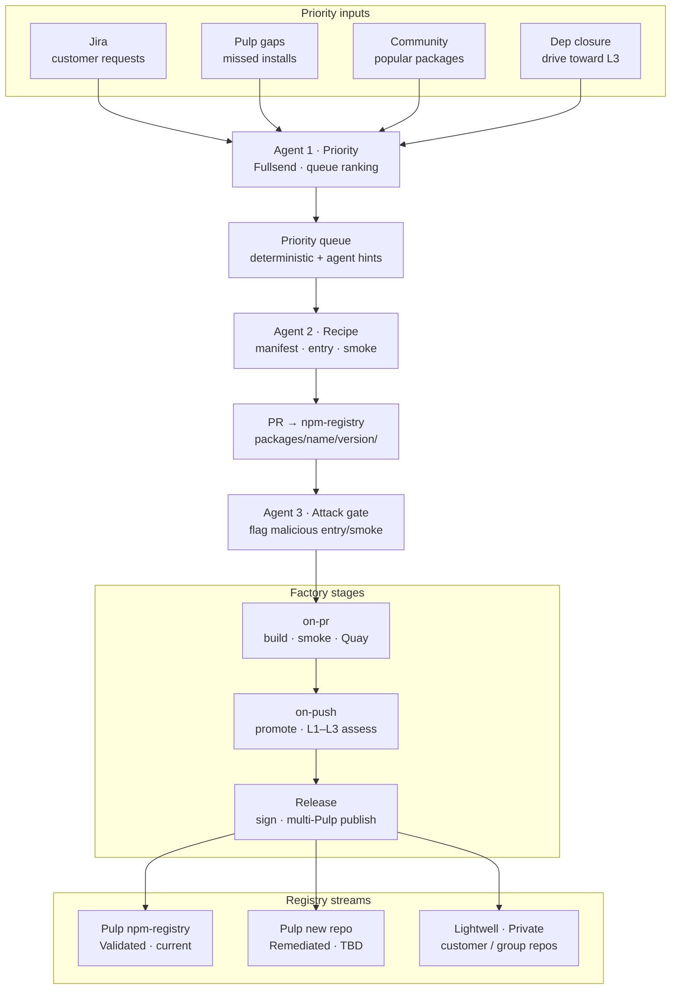
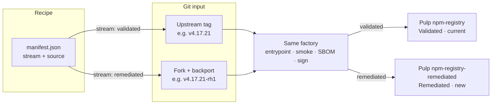
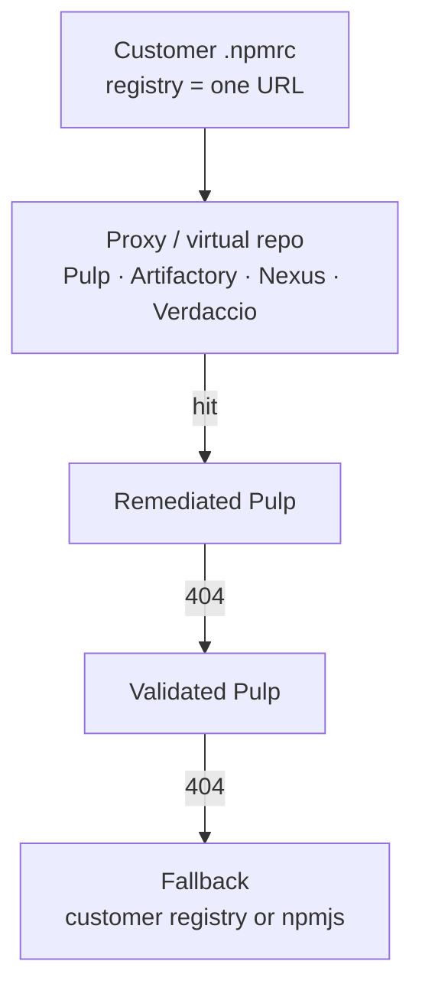

# Proposal: npm Lightwell — factory + recipe onboarding


| Field       | Value                    |
| ----------- | ------------------------ |
| **Status**  | Draft                    |
| **Authors** | Lightwell / TL team (draft for review) |
| **Date**    | 2026-09-02               |


## Summary

Lightwell for npm adopts a **factory + recipe** model with two **streams** that share the same factory:

| Stream | Lightwell name | Pulp repository | What it is | PoC |
|--------|----------------|-----------------|------------|-----|
| **`validated`** | Validated | **Existing** `npm-registry` (`javascript/` distribution) | Rebuild **upstream** git at `source.ref` (the npm version’s tag/commit). Publish identity matches community `name@version`. | **This is what the PoC implements** (all releases go here today). |
| **`remediated`** | Remediated | **New** repo (name TBD) + its own distribution | Same recipe + factory, but `source.url` / `source.ref` point at a **git fork** where the CVE **backport** lives. Publish identity is a **product decision** (same semver vs bumped version — [open](#open-decision-remediated-version-identity)). | Recipe shape is defined; **Pulp repo and `stream`→repo routing are not wired**. |

- **Lightwell** operates CI/CD, standard **linux-x64 glibc** builder images, SBOM generation, signing, and Pulp publish — the **trusted factory**.
- **Onboarders** supply, per package version: a **manifest** (JSON metadata, including `stream`), an **entrypoint build script**, and a **smoke-test script** — the **recipe**.
- The factory does **not** infer source locations, build commands, or native/binary layout from npm metadata alone.
- **Every onboarded version is built from source** at the git `ref` in the manifest. The factory does **not** republish tarballs downloaded from registry.npmjs.org.
- **Tier B/C:** one manifest entry produces **all** declared `outputs` (main npm package + linux-x64 platform package) in a **single** factory run of `build.entrypoint.sh`.

Onboarding lives in a **dedicated Calunga git repository** (`npm-registry`; historically discussed as `calunga-npm-onboarding`). Builder images are defined and built from **`plumbing`**.

Human review is required on every onboarding change; AI agents may **draft** PRs but do not sign releases or approve policy gates.

**Consumption** is one customer `registry=` URL (npm does not chain registries client-side). A **proxy** (Pulp virtual repo, Artifactory/Nexus, Verdaccio, or equivalent) implements: **remediated → 404 → validated → 404 → customer-chosen fallback or default registry.npmjs.org**. Lightwell **need not operate** that proxy or **redistribute** the public npmjs catalog — see [Consumer registry URL and proxy chain](#consumer-registry-url-and-proxy-chain).

### High-level flow: agents → factory → multi-Pulp publish

Emphasize pipeline **inputs** (three Fullsend agents) and **outputs** (registry families). Factory internals are stage boxes only — no task-level detail.



Consumers (RH engineering and Lightwell subscribers) pull from the registry family that matches their access — see the output table below.

#### Input — Fullsend agents

| Agent | Role |
| ----- | ---- |
| **1 · Priority queue** | Ranks work from a deterministic base: **Jira** (customer requests), **Pulp** (packages customers need but missed from the registry), **Community** (most popular packages), **Dependency closure** (push toward L3). The agent may propose extra sources; ranking stays explainable. |
| **2 · Recipe builder** | Dequeues the next package, drafts `manifest.json`, `build.entrypoint.sh`, and `verify.smoke.sh`, and opens a PR to `npm-registry` under `packages/<name>/<version>/`. Humans still approve; AI does not sign or publish. |
| **3 · Attack gate** | Reviews entrypoint, smoke, and what they invoke for malicious intent **before** on-pr is allowed to run. Fail or flag blocks the factory build until cleared. |

#### Factory — stages only

| Stage | What it does (high level) |
| ----- | ------------------------- |
| **on-pr** | Build from git source · smoke · Quay on-pr artifact |
| **on-push** | Promote snapshot · assess L1–L3 · compliance sidecars |
| **Release** | Attest · publish `.tgz` + compliance to target Pulp(s) |

Input to the factory: an approved recipe PR. Output of the factory: signed packages + compliance records ready for multi-registry publish.

#### Output — registry streams (Pulp content)

| Registry | Manifest `stream` | Pulp repository | Notes |
| -------- | ----------------- | --------------- | ----- |
| **Validated** | `validated` | **Existing** `npm-registry` (PoC `javascript/` distribution) | Factory rebuild of **upstream** git. Same `name@version` as npmjs. |
| **Remediated** | `remediated` | **New** Pulp npm repository (name TBD) + its own distribution | Factory rebuild of a **fork** with backported CVE fixes. Version string is an [open decision](#open-decision-remediated-version-identity). |
| **Lightwell · Private** | (separate repos) | Per-customer Pulp repos | Private repositories for a specific customer or group. |

Customers typically configure **one** `.npmrc` `registry=` URL. The **proxy chain** (remediated → validated → fallback) is described below; it is not three URLs in the npm client.

---

## Background

npm packages do not share a single build interface (unlike PEP 517 + wheels). Native tooling often splits JS wrappers and linux-x64 binaries across **optional dependencies** (e.g. `esbuild` + `@esbuild/linux-x64`). TL cannot scalably **guess** builds; onboarders declare **source** and **entrypoint** in a recipe PR.

Python RHTL pins versions in `index/onboarded_packages/<name>.json` and builds via **Fromager** from **sdist**. npm TL mirrors that intent: **build from declared git source**, not from npmjs tarballs. Published `.tgz` files are **outputs** of the factory (like wheels), even when install layout resembles upstream npm.

**Dependency closure** on the TL registry grows over time. Each published version carries a **compliance level** (`L1`–`L3`) describing how much of its production dependency tree is available from TL vs upstream registry at install time. Publish is allowed at any level; stricter org policy can require `L3` for production.

### Native tiers (for manifests and review)

| Tier | Description | Examples |
| ---- | ----------- | -------- |
| **A** | Pure JS; no linux-x64 binary package required | `express` |
| **B** | Platform optional family; main pkg + one TL linux-x64 binary package | `esbuild`, `sharp` |
| **C** | Compile-heavy; allowlisted only; strict smoke + recipe review | node-gyp-heavy deps |

---

## Streams: `validated` vs `remediated`

Recipes declare `stream` in `manifest.json`. Both streams use the **same** Konflux factory, builder images, SBOM, signing, and Pulp upload **task**. Release **routes by `stream`** to **two Pulp npm repositories** (same domain, different repo + distribution):

| Manifest `stream` | Pulp repository | Distribution / content (illustrative) | Status |
| ----------------- | --------------- | ------------------------------------- | ------ |
| `validated` | **Current** PoC repo: `npm-registry` | `…/public-trusted-libraries/javascript/` | **Ships today** |
| `remediated` | **New** repo (name TBD, e.g. `npm-registry-remediated`) | Separate `base_path` (e.g. `javascript-remediated/`) | **Not in PoC** — create when Remediated recipes exist |

PoC **does not** switch Pulp targets yet: every release still uploads to `npm-registry` / `javascript/`. Wiring `stream` → repository is a follow-up on the RPA / `upload-npm-pulp` params (`pulpRepository`), not a factory rebuild.



### Validated (PoC)

- **`stream`: `"validated"`**
- `source.url` is the **community / upstream** repository (or a mirror of it).
- `source.ref` is the tag or commit that corresponds to the **npm version** being onboarded (`upstream_npm.version`).
- Published `name` / `version` **match** that npm identity (e.g. `lodash@4.17.21`).
- **Immutable once released:** do not overwrite the tarball for a given `name@version` on Validated (recipe fixes onboard a new directory or follow rebuild policy). First lockfile cutover to Lightwell refreshes `integrity`; later catalog growth is normal version upgrades, not weekly checksum resets.

This is the Trusted Libraries / **Validated** catalog: source-built drop-in for the same semver the community shipped.

### Remediated (same process, forked source)

- **`stream`: `"remediated"`**
- Factory and recipe **files are the same shape**: `manifest.json`, `build.entrypoint.sh`, `verify.smoke.sh` under `packages/<name>/<published-version>/`.
- `source.url` is a **git fork** (or downstream remote) where the backport is maintained.
- `source.ref` is the fork tag/branch/commit that **contains the fix** (not necessarily the upstream release tag).
- `upstream_npm.version` still records the **community line** being remediated (for review: “this rebuild remediates npm `4.17.21`”).
- Published `version` follows the [open decision](#open-decision-remediated-version-identity) (keep `4.17.21` vs bump).

**How to remediate with a recipe**

1. Fork upstream (or use an existing Lightwell/Red Hat fork). Apply the backport; tag a **reviewable** ref (e.g. `v4.17.21-rh1`).
2. Copy or draft a recipe as for Validated. Set `"stream": "remediated"`.
3. Point `source` at the **fork URL + backport ref**. Do **not** build from npmjs tarballs.
4. Set `name` / `version` to the **publish identity** (same as upstream or bumped — per policy).
5. Keep `upstream_npm` as the vulnerable community version + integrity for **audit**, not as build input.
6. Open a PR to `npm-registry`. Human review of the **fork diff** (backport) plus entrypoint/smoke is required. Agent 2 may draft the recipe; it must not invent a fork URL.
7. Merge → same on-pr / on-push / release path; release **`pulpRepository`** is the **new Remediated repo**, not `npm-registry`.

Remediated does **not** require a second factory. It is a **different git `source`** and a **different publish target**.

---

## Consumer registry URL and proxy chain

npm clients do **not** try a second registry on 404. Customers set **one** `registry=` in `.npmrc` (project or org). Fallback is implemented by a **registry proxy / virtual repository**, not by npm.

**Intended lookup order** (logical; one URL in `.npmrc`):

```text
npm install foo@x.y.z
  → customer Lightwell URL
       1. Remediated catalog   (stream: remediated)
       2. on 404 → Validated   (stream: validated)
       3. on 404 → fallback:
            a. customer-chosen registry (Artifactory group, internal npm, etc.), or
            b. default: registry.npmjs.org
```



**Legal / redistribution:** Lightwell **does not have to operate** a proxy that caches or republishes the **entire** public npmjs catalog. Prefer:

- **Tools and instructions** so the **customer** (or RH shared service) configures the virtual repo in **their** Artifactory/Nexus/Pulp, pointing remotes at Lightwell Remediated, Lightwell Validated, then **their** existing npmjs remote.
- Lightwell publishes **only factory-built** Validated and Remediated content.
- Default fallback to npmjs is **the customer’s remote**, not Lightwell mirroring npmjs.

Strict **Validated-only** (no npmjs fallback) remains an org policy option (L3-style). Remediated-first is for subscribers who want CVE backports when present.

**Cutover:** changing `.npmrc` to the proxy URL plus a **one-time lockfile `integrity` / `resolved` refresh** for packages now served from Validated (bytes differ from npmjs). That is migration, not a standing weekly reset, as long as Validated versions stay **immutable**.

---

## Goals

1. **Provable supply chain** — attestations bind published artifacts to TL builder image digest, git `ref`, and entrypoint script hash.
2. **Source-only builds** — `build.entrypoint.sh` clones/builds from `source.ref` only; `upstream_npm` is used for **verification**, not as the build input.
3. **Explicit recipes** — onboarders own build commands; TL owns the factory and compliance labeling.
3. **Bounded platform** — v1: **linux-x64**, **glibc** (UBI), one **Node LTS** per builder image line.
4. **Standard consumption** — TL-defined optional/binary packages (esbuild-style) so consumers resolve **TL-built** natives from Pulp.
5. **Graded closure compliance** — `L1` / `L2` / `L3` per version; catalog grows incrementally without blocking publish.
6. **Organizational scale** — package owners (or TL partners) maintain recipes via PR; TL maintains factory images and Konflux tasks.
7. **AI-assisted, human-gated** onboarding — agents draft manifests and scripts; humans verify ref↔version and script safety.

## Out of scope (v1)

- All CPU architectures or musl/Alpine (v1.1+).
- Automatic onboarding without PR review.
- TL-maintained universal native rebuild (Fromager-for-npm).
- Byte-identical parity with npmjs prebuilds.
- AI inside the signing path or hermetic build pod with outbound LLM access.

---

## Repository layout

### 1. `calunga-npm-onboarding` (new repo, name TBD)

Holds **one directory per onboarded package version** (or per package with versioned subdirs — see below).

```text
calunga-npm-onboarding/
  README.md
  CONTRIBUTING.md                 # PR checklist, review rules
  packages/
    esbuild/
      0.28.0/
        manifest.json
        build.entrypoint.sh
        verify.smoke.sh
    express/
      5.2.1/
        manifest.json
        build.entrypoint.sh
        verify.smoke.sh
    better-sqlite3/
      11.1.0/
        manifest.json
        build.entrypoint.sh
        verify.smoke.sh
        tl-install.js              # optional — Tier B/C install shim (see below)
```

**Alternative:** `packages/<name>/manifest.json` + scripts with version inside manifest only — team to pick one layout and enforce in CI.

Each onboarded **name@version** includes **at minimum** `manifest.json`, `build.entrypoint.sh`, and `verify.smoke.sh`. Tier **B/C** recipes may add **optional helper files** in the same directory (e.g. `tl-install.js`) that the entrypoint copies into the published main tarball — keep them small and PR-reviewable; do not hide install-time logic only inside bash heredocs.

### 2. `plumbing`

- **Builder images** — e.g. `quay.io/.../npm-builder` (UBI, Node 20 LTS, Go, Rust, gcc, python3 for node-gyp). Compiler/stdlib baseline must match onboarded native addons (e.g. C++20 may require **gcc-toolset** on UBI 8 or a newer base image — see [Support matrix](#support-matrix-v1)).
- **Tekton tasks / pipelines** — generic `build-npm-onboarded-package` that:
  - Clones onboarding repo at merged commit
  - Runs `build.entrypoint.sh` in chosen builder image
  - Runs `verify.smoke.sh`
  - Collects outputs, SBOM, sign, publish to Pulp
- Reuse patterns from `build-python-wheels-oci-ta`, `generate-and-sign-attestations`, `pulp-upload`.

### 3. `index` (existing)

- Product docs, support matrix, Konflux app wiring — may reference npm TL once operational.

---

## Onboard unit: manifest + scripts

Each onboarded **name@version** includes the three required scripts below (plus optional helpers for Tier B/C).

### One manifest, one build, multiple outputs

A single onboard directory (e.g. `packages/esbuild/0.28.0/`) defines **one** factory run:

- **One** `manifest.json`, **one** `build.entrypoint.sh`, **one** `verify.smoke.sh` (Tier B/C may add optional helpers such as `tl-install.js`).
- **One** checkout of `source.ref`.
- **One or more** `outputs[]` entries — e.g. main `npm-package` and `tl-platform-package` for Tier B.

Tier B and Tier C packages such as **esbuild** and **better-sqlite3** are **not** split across two onboarding PRs. The entrypoint must produce **both** tarballs listed in `outputs` (main package + `@calunga/<name>-linux-x64`) before publish. Smoke tests should cover both where applicable.

Tier A has a single `outputs` entry (main package only). Tier **B** and Tier **C** normally publish **main + `@calunga/<name>-linux-x64`** (see `outputs[]`); Tier C differs in that the platform binary is **compiled in the factory** (e.g. node-gyp), not downloaded as an upstream prebuild.

### `manifest.json`

Machine-readable metadata for CI and review.

```json
{
  "name": "esbuild",
  "version": "0.28.0",
  "description": "JavaScript bundler — linux-x64 binary + JS wrapper",
  "stream": "validated",
  "native_tier": "B",
  "source": {
    "url": "https://github.com/evanw/esbuild.git",
    "ref": "v0.28.0",
    "ref_type": "tag"
  },
  "upstream_npm": {
    "version": "0.28.0",
    "integrity": "sha512-..."
  },
  "entrypoint": "build.entrypoint.sh",
  "smoke": "verify.smoke.sh",
  "outputs": [
    {
      "id": "main",
      "type": "npm-package",
      "path": "out/esbuild-0.28.0.tgz",
      "pulp_name": "esbuild"
    },
    {
      "id": "linux-x64-binary",
      "type": "tl-platform-package",
      "path": "out/@calunga/esbuild-linux-x64-0.28.0.tgz",
      "pulp_name": "@calunga/esbuild-linux-x64",
      "platform": "linux-x64",
      "libc": "glibc"
    }
  ],
  "optional_dependencies_published": [
    "@calunga/esbuild-linux-x64@0.28.0"
  ]
}
```

Do **not** author `compliance_level`, `missing_gaps`, or `pending_l3_gaps` in the onboarding manifest. The pipeline **computes** them on **on-push** after querying the Validated registry and writes them as **sidecars** (not inside consumer packages). See [Where compliance metadata is stored](#where-compliance-metadata-is-stored).

**Remediated example** (same factory; fork is the build input). `version` here assumes a **bump** (open decision); `upstream_npm` is the line being fixed:

```json
{
  "name": "lodash",
  "version": "4.17.22",
  "stream": "remediated",
  "native_tier": "A",
  "source": {
    "url": "https://github.com/example-org/lodash.git",
    "ref": "v4.17.21-rh1",
    "ref_type": "tag"
  },
  "upstream_npm": {
    "version": "4.17.21",
    "integrity": "sha512-..."
  },
  "entrypoint": "build.entrypoint.sh",
  "smoke": "verify.smoke.sh",
  "outputs": [
    {
      "id": "main",
      "type": "npm-package",
      "path": "out/lodash-4.17.22.tgz",
      "pulp_name": "lodash"
    }
  ]
}
```

Fields are illustrative; JSON Schema lives in `docs/manifest.schema.json`.


| Field                             | Purpose                                                      |
| --------------------------------- | ------------------------------------------------------------ |
| `name` / `version`                | Publish identity (Validated: match npmjs. Remediated: per versioning decision) |
| `stream`                          | `validated` → existing Pulp `npm-registry`. `remediated` → **new** Pulp repo. |
| `native_tier`                     | `A` pure JS, `B` platform optional family, `C` compile-heavy |
| `source`                          | **Authoritative build input** — git URL + tag or commit. Validated: upstream. Remediated: **fork** with the fix. |
| `upstream_npm`                    | Community npm version + optional integrity; **verification / audit only**, not fetched for build |
| `entrypoint` / `smoke`            | Filenames in same directory                                  |
| `outputs`                         | All tarballs this manifest produces in one build (main + platform) |
| `optional_dependencies_published` | Platform packages wired from main package (Tier B/C)           |


Do **not** list production dependencies in the manifest. On-push assess reads `dependencies` from the **packed** `package.json` (what consumers install) and queries the TL packument, including semver ranges.


### `build.entrypoint.sh`

- **Required.** Runs **inside** TL builder only (non-interactive).
- Clones or uses mounted `source` at `ref` (CI may pre-checkout; script receives env vars).
- **Must not** use `npm pack <name>@<version>` from registry.npmjs.org or extract npmjs tarballs as the source of published artifacts.
- Produces **every** path in `outputs[]` under one run (e.g. `out/`).
- Must not call `npm publish` to npmjs, hold cosign keys, or exfiltrate secrets.
- Network: document required egress (git, language toolchains); default factory policy is allowlist-only.

Factory image version is pinned in the onboarding repo **PipelineRun** (`builder-image@sha256:...`), not in per-package manifests. Provenance records the digest used at build time.

**Tier B/C — assembling the published main tarball**

The entrypoint is responsible for **both** platform and main outputs, including **TL-specific wiring of the main `.tgz`** (not only compiling or copying upstream files):

1. Build or obtain the linux-x64 native artifact and pack `@calunga/<name>-linux-x64` (platform `outputs[]` entry).
2. Stage the **published** main package: JS/API files, updated `optionalDependencies`, stripped consumer compile paths (`prebuild-install`, `node-gyp`, `|| npm run build`, etc.).
3. Include a **TL install shim** (`install.js` or equivalent) that resolves the platform package from **Pulp only** — see [Published `package.json` and scripts policy](#published-packagejson-and-scripts-policy).
4. Pack the main tarball to the path in `outputs[]`.

Onboarders may **patch upstream** `install.js` (esbuild-style) or ship a **separate recipe file** (e.g. `tl-install.js`) that the entrypoint copies into the tarball as `install.js` — preferred when upstream has no small shim to adapt. Either way, the install helper diff must be visible in the PR.

Example responsibilities (package-specific):

- Tier A: build/pack from git tree (`npm pack` **from local checkout**, `npm run build`, etc.).
- Tier B: same run builds JS wrapper tarball **and** linux-x64 binary tarball (e.g. `go build` + layout for `@calunga/...-linux-x64`); patch or replace upstream install helper.
- Tier C: **compile** native artifacts from git (e.g. `node-gyp`) into the platform package; assemble main tarball **without** consumer compile fallbacks; same install-shim pattern as Tier B.

### `verify.smoke.sh`

- **Required.** Runs after build in the same builder image (or slim verifier with same glibc/Node).
- Exits non-zero on failure — blocks publish.
- Minimal checks: tarball layout, published `package.json` policy (Tier B/C), native artifact sanity (ELF / `--version` / `node --check` as appropriate).
- Use tools available in the **npm-builder** image (`od`, `tar`, `node`, `jq`) — do not assume optional packages such as `file(1)`.

---

## TL platform responsibilities (the factory)


| Capability                                             | Owner                   |
| ------------------------------------------------------ | ----------------------- |
| Builder images (UBI, Node LTS, toolchains)             | TL / `plumbing`         |
| Konflux pipeline (build → SBOM → sign → Pulp)          | TL / `plumbing`         |
| Hermetic / egress policy                               | TL                      |
| cosign / PEP-style attestations for published tarballs | TL pipeline only        |
| CVE / EC policy gates on pipeline output               | TL                      |
| Pulp npm repository                                    | TL                      |
| Consumption contract documentation + shim guidelines   | TL                      |
| Onboarding PR review (recipe correctness)              | Onboarder + TL reviewer |
| Factory security (image provenance, task trust)        | TL                      |


---

## Dependency closure compliance (L1, L2, L3)

Compliance describes **where production dependencies may resolve at `npm install` time** for consumers of this **name@version**. It does **not** block publish: TL ships source-built artifacts with SBOM and attestations at every level. Stricter environments (e.g. production Konflux) may require a minimum level.

**What is always true (all levels):** this version’s **own** artifacts (main tarball and, for Tier B, `@calunga/<name>-linux-x64`) were **built from `source.ref`** in the TL factory — never repacked from npmjs.

| Level | Name | Production dependencies at install | Typical use |
| ----- | ---- | ------------------------------------ | ------------- |
| **L1** | `partial-closure` | **Mixed** — any prod dep not yet on TL may resolve from **upstream npm registry** | Early onboarding; leaves first |
| **L2** | `direct-closure` | **Direct** prod `dependencies` (a TL version matching the packed range) must be on TL; this package’s own TL platform optional is satisfied by the same recipe; transitive deps may still use npmjs | Most packages before full tree exists |
| **L3** | `full-closure` | **Entire production lockfile closure** for this package resolves **only** from TL registry (linux-x64 v1); **no npmjs** for prod tree | Target for production apps; “highest” compliance |

**Computing the level (on-push pipeline):**

1. Open the **main** `.tgz` (`outputs` type `npm-package`) and read packed `package.json` **`dependencies`** (not `devDependencies` or `peerDependencies`). `optionalDependencies` already in this snapshot (typically `@calunga/…-linux-x64` from the same recipe) are treated as satisfied; other optionals are ignored for v1.
2. On **push to main**, promote pipeline queries the TL javascript registry packument for each name + version **or range** (highest matching TL version).
3. Write **`schema_version` 3** sidecars: `compliance_level`, immutable `direct_dependencies` (`[{name, requested}]` only), **`missing_gaps`** (deps not on TL), **`pending_l3_gaps`** (deps on TL but not L3), **`assessed_at`**, and **`compliance_revision: 1`** — next to each tarball in the Quay OCI snapshot, **not** inside the `.tgz` consumers install.
4. **Release** copies sidecars to per-package compliance OCI + Pulp labels, runs **`update-npm-closure update`** (closure waiter refresh + global index), and optionally mirrors fields in the attestation predicate.

**Level rules (schema v3):**

| Level | Sidecar condition |
| ----- | ----------------- |
| **L1** | `missing_gaps` non-empty |
| **L2** | `missing_gaps` empty and `pending_l3_gaps` non-empty |
| **L3** | both gap lists empty |

**v1 computation vs table names:** assess uses **direct** packed `dependencies` only — not full lockfile closure. True full-lockfile L3 in the table above remains a later tightening (see `docs/prod_followup.md` Assess quality).

**Why not inside the package?** Compliance is a **Trusted Libraries KPI / catalog property**, not part of the upstream library API. End users installing from Pulp should get a clean tarball (source-built bits + SBOM). Operators and dashboards query Pulp (or compliance OCI) for level without unpacking `.tgz` files.

**Assess vs release closure updates:**

- **Validated** publishes **`name@version` matching upstream semver** (e.g. `vite@5.4.0`). Do not use Lightwell-only suffixes on the Validated stream.
- **Remediated** version strings are an [open decision](#open-decision-remediated-version-identity).
- **On-push assess** writes the **initial** compliance record (level + gap lists + immutable deps).
- **Release closure updater** (`update-npm-closure` in plumbing-utils) may **mutate only** `missing_gaps`, `pending_l3_gaps`, `compliance_level`, `closure_updated_at`, and `compliance_revision` on **waiter** packages when a blocker lands or reaches L3 — without republishing the blocker’s tarball.
- Example: when `esbuild@0.28.0` reaches L3, packages that listed it in `pending_l3_gaps` can move **L2 → L3**; their compliance OCI and Pulp `tl.compliance_level` label are updated in place.
- **`direct_dependencies` is immutable** after assess (manifest intent only); full dependency detail remains in the published package / lockfile.

**Re-publish same semver on Validated** only for **recipe/security fixes** (bad build, wrong ref) — not as a substitute for closure propagation (that is the closure updater’s job). Same-semver overwrite as a **Remediated CVE channel** is the other side of the versioning open decision.

**Incremental growth:** onboard leaves first (often **L3** at first publish — no packed `dependencies`). Parents onboarded early may publish at **L1/L2**; the **global closure index** records which packages wait on each blocker so landing a dep refreshes waiters without scanning the whole catalog. AI prioritizes onboarding deps that appear in packed `dependencies` of pending recipes.

**Install behavior by level:**

- **L1:** Main package uses TL shim for **its own** `@calunga/*` platform dep. Other deps may install from npmjs per consumer `.npmrc` / lockfile.
- **L2:** Direct deps must be on TL; lockfile should pin TL URLs for those names.
- **L3:** Org configures **only** TL registry; lockfile fully resolved to Pulp.

---

## Where compliance metadata is stored

Compliance is a **TL catalog / KPI record**, kept **outside** the consumer-installable package. Layered storage:

| Location | File / field | Who writes | When | Audience |
| -------- | ------------ | ---------- | ---- | -------- |
| **Onboarding repo** | `manifest.json` (identity, source, outputs) — **not** a dep pin list | Human / AI in PR | Authoring | Recipe; CI groups outputs / `built_from` |
| **Quay OCI snapshot** (`:<merge-sha>.npm`) | Sidecar next to each `.tgz` (see naming below) | **on-push** promote pipeline | After merge | Release input; audit |
| **Quay OCI (per package)** | `COMPLIANCE_IMAGE_PREFIX:<name-version>` — full `*.tl-compliance.json` | **Release** closure step | Publish / closure update | Authoritative compliance doc; CAS via `compliance_revision` |
| **Quay OCI (global)** | `npm-closure-index.json` at `CLOSURE_INDEX_IMAGE` | **Release** closure step | Publish / rebalance | Reverse gap index (blocker → waiters); CAS via `revision` |
| **Pulp Prod** | Content labels on npm package unit | **Release** pipeline | Publish / closure update | **Operators** — `tl.compliance_level`, `tl.compliance_oci_digest` only (no index digest on Pulp) |
| **Attestation predicate** (optional) | `compliance_level`, gap summary, `assessed_at` | **Release** (with sign) | Release | Sigstore / EC verification |

**Not stored in:** the published main or platform `.tgz` (no `tl-compliance.json` / compliance fields inside `package/` for end users).

**Authoring rule:** do **not** declare a parallel dep list in `manifest.json`. **on-push CI** reads packed `package.json` `dependencies`, queries TL, and writes schema v3 sidecars; **release** publishes compliance OCI, runs closure update, and sets Pulp labels.

Canonical field reference: [`docs/tl-compliance-schema-v3.md`](tl-compliance-schema-v3.md).

### OCI sidecar naming (on-push snapshot)

One sidecar per published npm identity (main and each platform output), sitting beside the tarball in the flat OCI artifact:

```text
vite-5.4.0.tgz
vite-5.4.0.tl-compliance.json
@calunga/esbuild-linux-x64-0.28.0.tgz
@calunga/esbuild-linux-x64-0.28.0.tl-compliance.json
… (SBOMs remain embedded inside each .tgz under package/sboms/redhat.spdx.json)
```

Platform packages share the **same** `compliance_level` / gap lists as the sibling main package from the same recipe (one manifest → one compliance story), and may add binary identity fields.

**`*.tl-compliance.json`** shape (schema v3 — see [`tl-compliance-schema-v3.md`](tl-compliance-schema-v3.md)):

```json
{
  "schema_version": 3,
  "name": "vite",
  "version": "5.4.0",
  "compliance_level": "L2",
  "assessed_at": "2026-05-20T14:32:00Z",
  "compliance_revision": 1,
  "direct_dependencies": [
    { "name": "rollup", "requested": "^4.0.0" }
  ],
  "missing_gaps": [],
  "pending_l3_gaps": ["rollup@4.22.0"],
  "built_from": {
    "url": "https://github.com/vitejs/vite.git",
    "ref": "v5.4.0"
  },
  "tarball": "vite-5.4.0.tgz",
  "tarball_sha256": "…"
}
```

Gap entries are **`name@version` strings** (resolved pin at assess time). They must correspond to a name in `direct_dependencies`. The closure updater mutates gap lists and level only — never `direct_dependencies`.

**Global closure index** (`npm-closure-index.json`, separate OCI artifact):

```json
{
  "schema_version": 1,
  "revision": 42,
  "updated_at": "2026-05-20T15:00:00Z",
  "entries": {
    "rollup@4.22.0": { "parents": ["vite@5.4.0"] }
  }
}
```

Each release registers the package as a **parent** on every blocker in its gap lists. When a blocker lands or reaches L3, the closure updater refreshes indexed waiters and removes the blocker entry.

Platform sidecar example (same level, plus layout):

```json
{
  "schema_version": 3,
  "name": "@calunga/esbuild-linux-x64",
  "version": "0.28.0",
  "compliance_level": "L3",
  "assessed_at": "2026-05-20T14:32:00Z",
  "compliance_revision": 1,
  "missing_gaps": [],
  "pending_l3_gaps": [],
  "platform": { "os": "linux", "cpu": "x64", "libc": "glibc" },
  "tarball": "@calunga/esbuild-linux-x64-0.28.0.tgz",
  "tarball_sha256": "…",
  "sibling_main": "esbuild@0.28.0"
}
```

### Pulp: query without unpacking

Release **does not** stuff compliance into the npm tarball. It:

1. Publishes each `.tgz` to the npm repository (consumer install path stays clean).
2. Pushes each `*.tl-compliance.json` to **per-package compliance OCI** and sets Pulp labels `tl.compliance_level`, `tl.compliance_oci_digest`.
3. Runs **`update-npm-closure update`** (refresh waiters, register on global index) and maintains **`npm-closure-index.json`** OCI.
4. Operators query level via Pulp labels or pull compliance OCI — without unpacking the package.

Repair / drift: **`update-npm-closure rebalance`** (plumbing-utils; full or `--index-only`). Assess stays in **npm-builder**; closure update and rebalance stay in **plumbing-utils** (Pulp credentials).

---

## Consumption contract (TL platform packages v1)

For **this package’s own** Tier B binary, consumers must resolve **`@calunga/<name>-linux-x64`** from **Pulp** (TL-built in the same manifest). That holds at **all compliance levels** — TL never publishes a platform package that points at npmjs prebuilds.

### Naming (proposed)


| Artifact        | Pulp / npm name                           |
| --------------- | ----------------------------------------- |
| Main package    | `<name>` @ `<version>` (e.g. `esbuild`)   |
| Platform binary | `@calunga/<name>-linux-x64` @ `<version>` |


Exact scope (`@calunga` vs `@redhat-trusted-libraries`) is an open decision; must be stable across the index.

### Layout inside platform package

```text
package/
  bin/<tool>              # or sharp.node path per recipe
  README.md
  package.json
  sboms/redhat.spdx.json  # Syft SPDX (build-time; Python wheel parity)
```

Main package layout additionally includes:

```text
package/
  sboms/redhat.spdx.json  # Syft SPDX (build-time; Python wheel parity)
  ...
```

Compliance sidecars (`*.tl-compliance.json`) live **next to** the `.tgz` in the Quay/Pulp transport layer — not under `package/`.
Main package includes a **TL-maintained or onboarding-supplied** install shim (reviewed in PR) that:

1. Resolves `@calunga/<name>-linux-x64` from **TL registry URL** (this package’s platform output).
2. Falls back to clear error if optional missing — **no** silent fetch of **TL platform** binaries from npmjs.

At **L1**, other (non-TL) prod dependencies may still resolve from upstream registry per lockfile; shims must not conflate that with **this** package’s own `@calunga/*` binary.

Onboarders may adapt upstream `install.js` in the recipe PR; changes must be visible in diff review.

### Published `package.json` and scripts policy

The **main** tarball published to Pulp is usually **not** byte-identical to npmjs. Changes are **small and PR-visible**, focused on wiring TL platform packages and install-time behavior.

#### Factory vs consumer scripts

| Location | Role |
| -------- | ---- |
| `build.entrypoint.sh` (onboarding repo) | May invoke `npm run build`, `go build`, upstream release tooling — **not** shipped to consumers |
| Published main tarball | Only scripts that run on **`npm install`** are in scope for TL policy |

Upstream dev scripts (`test`, `lint`, `docs-build`) are normally **absent** from the published `.tgz` or irrelevant; do not need TL rewrites.

#### `package.json` fields that commonly change

| Field | Typical TL change |
| ----- | ----------------- |
| `optionalDependencies` | Rename platform deps to `@calunga/<name>-linux-x64` (or chosen scope) |
| `install` / `postinstall` | Point at TL-reviewed shim (see below) |
| `files` | Add SBOM path `sboms/redhat.spdx.json`; **not** compliance JSON |
| `prepare` | Often **removed** or omitted from published package so install does not trigger builds |

Usually **unchanged**: `name`, `version`, `main` / `exports`, `dependencies` for pure JS deps, public API.

The **platform package** uses a **new** minimal `package.json` (binary layout only); it is not a patch of upstream’s `@esbuild/*` / `@img/*` manifest.

#### Install-time scripts (main touch point)

| Tier | Expectation |
| ---- | ----------- |
| **A** | Often **no** `install` / `postinstall`; optional `files` only |
| **B** | **Targeted** change: `postinstall` / `install` + helper JS (e.g. `install.js`) |
| **C** | Same as B; **compile** runs in factory via entrypoint, **not** on consumer via `node-gyp` fallback |

**Upstream patterns → TL intent**

- **esbuild (Tier B):** `postinstall` → `node install.js` selecting `@esbuild/linux-x64` from npmjs → entrypoint patches upstream `install.js` so the shim resolves `@calunga/esbuild-linux-x64` from **Pulp only**.
- **better-sqlite3 (Tier C):** `install` → `prebuild-install || node-gyp rebuild` → entrypoint compiles in factory, ships `tl-install.js` as `install.js`, removes consumer compile path from published `package.json`.
- **sharp (Tier B/C):** `install` → `node install/check.js || npm run build` → TL shim loads prebuilt from platform package; **remove** consumer compile-at-install path from published artifact.

#### Preferred strategies (least → most invasive)

1. **Replace or add helper file** — keep `"postinstall": "node install.js"` (or `"install": "node install.js"`) and ship TL `install.js` in the tarball. Source it from a recipe sibling (e.g. `tl-install.js`) or patch upstream — clear PR diff.
2. **Publish with install scripts stripped** — only if optional deps are always resolved from Pulp and org policy allows `npm install --ignore-scripts` for edge cases.
3. **Broad `scripts` rewrites** — avoid unless necessary; increases review burden and drift from upstream.

Default: **(1)**. No silent fallback to npmjs for **this package’s** `@calunga/*` platform optional. At **L1**, other dependencies may still use npmjs — document gaps in **`missing_gaps`** on the compliance sidecar / Pulp label.

#### PR review checklist (scripts)

- [ ] Diff of published `package.json` vs upstream called out in PR description
- [ ] Install/postinstall helpers reviewed line-by-line (no `curl`/`npm install` to npmjs, no `node-gyp` on consumer for Tier B/C)
- [ ] `optionalDependencies` names and versions match manifest `outputs` / `optional_dependencies_published`
- [ ] Tier C: published package does not retain `|| npm run build` style fallbacks

#### What “significant” means here

**Significant** = install-time **behavior and supply-chain risk**, not a large `scripts` block. A few lines in `package.json` plus one shim file is normal for Tier B.

---

## CI/CD flow

Three Konflux pipelines, mirroring **Python `index`** (build → Quay OCI → release → Pulp prod) with an extra **Pulp Stage** on PR so recipes are built and installable before merge.

**Repos:** onboarding PRs land in `calunga-npm-onboarding` (name TBD). **Registries:** Pulp **Stage** (pre-merge), Quay **OCI** (post-merge transport), Pulp **Prod** (consumer `npm install`).

```text
PR → calunga-npm-onboarding
│
▼ on-pr (PipelineRun: pull_request → main)
├─ Static gate (fail PR)
│    ├─ lint: manifest schema, script shellcheck, no secrets
│    └─ policy: tier vs outputs[]; builder image pin
│
▼ Konflux build pipeline (same task graph as Python build-wheels pattern)
├─ identify changed packages/<name>/<version>/ (path filter or git diff vs origin/main)
├─ checkout onboarding path @ PR commit + source.ref (git)
├─ verify: package.json version at source.ref matches upstream_npm.version
├─ run build.entrypoint.sh in builder image  → all outputs[] (main + platform)
├─ run verify.smoke.sh
├─ embed SPDX SBOM into each collected .tgz (Syft → package/sboms/redhat.spdx.json)
└─ oras push → Quay on-pr-<sha>.npm  (tarballs only; no compliance sidecar yet)
     (optional Pulp Stage publish when enabled — PoC may skip Stage)
│
▼ human review + merge
│
▼ on-push (PipelineRun: push → main)  — promote + compliance assess
├─ identify packages promoted by this merge (prev ref HEAD^)
├─ resolve on-pr-<merge-sha>.npm (or agreed policy); verify SBOM-in-tarball
├─ compute compliance_level (L1–L3) + missing_gaps + pending_l3_gaps + direct_dependencies + assessed_at
│    (query TL Prod packument for packed package.json dependencies; ranges allowed)
├─ write *.tl-compliance.json sidecars (schema v3) next to each .tgz
└─ oras push → Quay durable snapshot
     e.g. quay.io/.../calunga-npm-onboarding:<merge-sha>.npm
     contents: *.tgz (+ embedded sboms) + *.tl-compliance.json
│
▼ Release (ReleasePlan → rhtap-releng-tenant, auto-release on snapshot)
├─ oras pull Quay snapshot
├─ cosign attest each .tgz (release SA / KMS; optional compliance fields in predicate)
├─ npm publish each .tgz → Pulp Prod  (consumer packages stay clean)
├─ publish compliance OCI per package + set Pulp labels (tl.compliance_level, tl.compliance_oci_digest)
└─ update-npm-closure update (+ global npm-closure-index.json OCI)
     refresh waiters when blockers land; register release on gap index
│
▼ consumers: npm install --registry <TL Pulp Prod>
▼ operators: Pulp labels / compliance OCI → compliance_level for name@version
```
### Stage vs prod (review notes)

| Stage | When | Rebuild? | Registry | Consumer use |
| ----- | ---- | -------- | -------- | -------------- |
| **Pulp Stage** (optional) | `on-pr` | **Yes** — full factory from git source | Internal stage npm registry | PR validation; **not** production |
| **Quay OCI (on-pr)** | `on-pr` | **Yes** | `…:on-pr-<sha>.npm` | Ephemeral PR artifact (tarballs + in-tarball SBOM) |
| **Quay OCI (snapshot)** | `on-push` | **No** — promote + **assess compliance** | `…:<merge-sha>.npm` | Release input: tarballs + `*.tl-compliance.json` sidecars |
| **Pulp Prod** | **Release** | **No** | `packages.redhat.com/...` | Production installs; compliance via **labels / adjacent records** |

**Alignment with Python:** Python **on-push** builds wheels and pushes **directly to Quay** (no Pulp Stage). npm PoC similarly uses Quay for transport; Stage is optional. **Compliance assess runs on-push** (when the durable snapshot is formed), not inside consumer packages.

**Compliance:** Level is computed on **on-push** assess (initial gap lists + level). **Release closure updater** may advance waiter packages when dependencies land (mutates gap lists + `compliance_level` on compliance OCI and Pulp labels). Global **closure index** avoids full-catalog scans. Direct deps only for v1 assess; full lockfile closure is a later tightening.
**PR vs merge commit:** Stage publish uses **PR head** revision. Merge promotion assumes the **merged PR** built successfully on that head (or final push to PR branch). If `main` moves without a fresh PR build, policy should require a green `on-pr` on the merge commit or re-trigger build — open operational detail.

### Triggers (Pipelines-as-Code)

| PipelineRun | CEL (example) | Params note |
| ----------- | ------------- | ----------- |
| `…-on-pull-request` | `event == "pull_request" && target_branch == "main"` | Pulp Stage URL; `output-image` optional for OCI skip |
| `…-on-push` | `event == "push" && target_branch == "main"` | Quay `output-image: …:{{revision}}.npm`; `prev-packages-ref: HEAD^` |
| **Release** | ReleasePlan in `konflux-release-data` tenants-config on `calunga-npm-registry-main` | RPA in same repo; releng pulls Quay snapshot artifact |

### Verification gates

**on-pr (fail PR / no Stage publish)**

1. Manifest schema; tier vs `outputs[]`; shellcheck; no secrets.  
2. `build.entrypoint.sh` + `verify.smoke.sh`; all `outputs[]` produced from **git source only**.  
3. Ref ↔ `upstream_npm.version` (sanity; not build input).  
4. Install-script policy on built tree — [Published `package.json` and scripts policy](#published-packagejson-and-scripts-policy).  
5. Human TL reviewer approval.

**on-pr (before Quay on-pr push)**

6. SBOM embedded in each `.tgz`.  
7. (No compliance sidecar yet — deferred to on-push.)

**on-push (fail merge pipeline)**

8. Resolve on-pr artifact for merge SHA; SBOM-in-tarball checks.  
9. Compute `compliance_level` + write schema v3 `*.tl-compliance.json` sidecars.  
10. oras push durable Quay snapshot (tarballs + compliance sidecars).

**release (fail release / no Prod publish)**

11. Re-verify snapshot contents.  
12. cosign attest `.tgz` (KMS); optional compliance fields in predicate.  
13. Publish `.tgz` to Pulp Prod; push compliance OCI + Pulp labels per package.  
14. Run **`update-npm-closure update`** per released package; maintain global closure index OCI.  
15. EC / CVE policy when wired.  
16. Prod publish only from release pipeline service account.
### Python `index` parallel

| Step | Python | npm TL (this proposal) |
| ---- | ------ | ---------------------- |
| PR gate | `on-pr` → build-wheels → Quay `on-pr-*` (5d TTL) | `on-pr` → build → **Pulp Stage** |
| Merge | `on-push` → **rebuild** → Quay `:<sha>.wheel` | `on-push` → **promote Stage** → Quay `:<sha>.npm` |
| Release | releng: Quay → attest → **Pulp PyPI prod** | releng: Quay → verify → **Pulp npm prod** |
| Consumer index | `packages.redhat.com/.../python/` | `packages.redhat.com/.../npm/` (prod) |

---

## Governance: AI + human-in-the-loop


| Step                                                   | Actor                                       |
| ------------------------------------------------------ | ------------------------------------------- |
| Draft manifest + scripts from upstream docs / lockfile | AI agent (advisor, read-only to registries) |
| Open PR to `calunga-npm-onboarding`                    | Human or agent under human account          |
| Review tag↔version, script safety, outputs, tier       | **TL reviewer** (required)                  |
| Second review for Tier C                               | Recommended                                 |
| `on-pr` → build + attest + Pulp Stage                  | Konflux PR pipeline (no LLM in pod)         |
| `on-push` → promote Stage → Quay OCI                   | Konflux push pipeline                       |
| Release → Pulp Prod                                    | rhtap-releng release pipeline only          |


AI must **not** run inside the hermetic build with registry credentials or trigger cosign.

---

## Support matrix (v1)

| Dimension | v1                                          |
| --------- | ------------------------------------------- |
| OS / arch | linux-x64                                   |
| libc      | glibc (UBI)                                 |
| Node      | 20 LTS (example; pin per builder image tag) |
| Factory toolchain | Must satisfy **onboarded** native builds (e.g. node-gyp, C++ standard). Raising compiler requirements is a **`plumbing` npm-builder** change (gcc-toolset on UBI 8, or newer UBI base), not a per-recipe version downgrade. |
| Registry  | **Prod:** TL npm registry for installs; **Stage:** optional PR builds; **L1/L2** may mix upstream npm for deps listed in `missing_gaps` |


musl / arm64: out of scope until v1.1 manifests declare additional `outputs`.

---

## Comparison to Python onboarding


|             | Python (`index`)              | npm (proposed)                                                              |
| ----------- | ----------------------------- | --------------------------------------------------------------------------- |
| Repo        | `index/onboarded_packages/`   | **`calunga-npm-onboarding`**                                                |
| Pin         | `version`, `ignored_versions` | `version` + **`source.ref`** + scripts                                      |
| Build logic | **Fromager** (central)        | **`build.entrypoint.sh`** (per package)                                     |
| Builder     | `plumbing` calunga-builder    | **`plumbing` npm-builder image(s)**                                         |
| Artifact    | wheel + SPDX (`redhat.spdx.json`) | npm tarball + SPDX (`redhat.spdx.json` via Syft) + **TL platform package** |
| PR output   | Quay OCI (`on-pr-*`)          | **Pulp Stage** (+ attest)                                                   |
| Merge output| Quay OCI (`:<sha>.wheel`)     | Quay OCI (`:<sha>.npm`) from Stage promotion                                |
| Consumer    | Pulp PyPI prod                | **Pulp npm prod**                                                           |
| Trust claim | We built wheel from sdist     | We built **declared outputs** from **declared ref** with **audited script** |


---

## Risks and mitigations


| Risk                              | Mitigation                                                                      |
| --------------------------------- | ------------------------------------------------------------------------------- |
| Wrong git ref for npm version     | CI verification gate; human review                                              |
| Malicious entrypoint              | PR review, shellcheck, no secrets in repo, hermetic egress, no cosign in script |
| Recipe drift                      | Rebuild on manifest merge; optional nightly rebuild                             |
| Transitive natives                | One manifest builds main + platform; separate onboard entry per dep over time   |
| Consumer uses npmjs at L1         | Document in compliance sidecar / Pulp labels; raise level as deps publish to TL |
| Builder compromise                | Standard Konflux trusted tasks, image digest pins, EC                           |
| Over-reliance on AI               | Human approval required; AI outside sign path                                   |


---

## Phased rollout


| Phase | Deliverable                                                                               |
| ----- | ----------------------------------------------------------------------------------------- |
| **0** | This proposal + JSON schema draft + CONTRIBUTING checklist                                |
| **1** | `plumbing`: npm builder image (node20-glibc) + manual pipeline for one Tier A (`express`) |
| **2** | Onboarding repo + Tier B pilot (`esbuild`) with platform package publish                  |
| **3** | `on-pr` / `on-push` / Release PipelineRuns; Stage + Quay + Pulp prod path                 |
| **4** | Tier C pilot (`sharp` or simpler native) + AI PR template                                 |
| **5** | Support matrix in `index/docs`; production publish only via plumbing pipeline          |


---

## Open decisions

- Final repo name: `calunga-npm-onboarding` vs `npm-registry` (current PoC repo)
- Scope namespace: `@calunga/` vs `@redhat-trusted-libraries/`
- Directory layout: `packages/<name>/<version>/` vs single manifest per name
- **Decided (Validated):** no Lightwell-only semver suffixes on Validated `name@version`; assess writes initial compliance; **release closure updater** may advance waiter levels (L1→L2→L3) via gap-list mutation on compliance OCI + Pulp labels — not by republishing the waiter tarball
- **Open (Remediated version identity):** see below
- **Decided:** three-stage publish — **Pulp Stage** (on-pr build) → **Quay OCI** (on-push promote) → **Pulp Prod** (release)
- on-push: promote from Stage vs rebuild on merge (default: **promote**; document merge-commit / PR head alignment)
- Who owns long-term recipe maintenance (onboarder vs Lightwell SRE)
- Minimum compliance level for production consumers (org policy defaulting to `L3`)
- Who hosts the [consumer proxy](#consumer-registry-url-and-proxy-chain) (customer Artifactory vs RH-managed vs Pulp virtual repo)
- Exact Pulp **repository name** and `base_path` for Remediated (Validated keeps `npm-registry` / `javascript/`)

### Open decision: Remediated version identity

**Rejected:** npm **build metadata** (`4.17.21+lwl.1`) is not a distinct publishable version (unlike Python PEP 440 `+cgr.N`). npm **prereleases** (`4.17.21-lwl.1`) do not satisfy `^4.17.21` or an exact pin of `4.17.21`, so they are not a delivery channel. Remediated publish identity is only:

| Option | Publish as | Customer update path | Exact parent `"lodash": "4.17.21"` | Notes |
| ------ | ---------- | -------------------- | ----------------------------------- | ----- |
| **A. Bump** | Next community-style semver, e.g. patch `4.17.22` | Familiar: `npm update`, Dependabot, Renovate | Blocked unless app `overrides` or parent republishes | Matches org CVE process |
| **B. Same semver** | Overwrite / publish `4.17.21` on **Remediated** only | Lockfile `resolved` + `integrity` refresh; not a version bump | Still satisfies the pin | Frozen-pin SKU; Dependabot typically **does not** notice digest-only changes; `npm ci` fails (`EINTEGRITY`) until lockfile updates |

**Leaning (product):** prefer **Option A (patch/minor bump)** so remediated rides existing update tooling; document `overrides` for exact parent pins (uncommon on public npm for lodash-class deps; more likely internally). Use **Option B** only if the SKU is “do not change the customer pin.”

**Validated stays Option B-shaped for identity** (same as upstream) but **immutable** — no silent overwrite for CVEs; CVEs go through Remediated recipes.

Recipe directory is always `packages/<name>/<published-version>/` — the folder name is the **Pulp version**, which may differ from `upstream_npm.version` when bumping.

---

## Appendix: supplementary design notes

Background material for reviewers; not part of the normative proposal above.

### Registry tarball vs git source

- npm `files` / pack output and a git repo are often **different subsets** of the same project.
- Fair mapping: **registry `.tgz` ≈ install artifact (wheel-like)**; **git tag + TL build ≈ sdist → wheel**.
- Registry `repository` metadata is optional and may be wrong; onboarding **`source.ref`** is authoritative for TL builds.

### Reference: esbuild and sharp (why Tier B exists)

**esbuild**

- Source: https://github.com/evanw/esbuild (Go).
- Main npm tarball: JS shim (`bin/esbuild` is a small Node script, not the compiler), `install.js`, `lib/main.js`.
- Real binary: optional `@esbuild/linux-x64` (~10 MB ELF), selected at install via `postinstall`.
- Consumers can also use GitHub Go releases or `ESBUILD_BINARY_PATH` outside npm.

**sharp**

- Source: https://github.com/lovell/sharp (C++ / libvips).
- Main npm tarball includes `src/*.cc` for **fallback** build, but default install uses prebuilt `@img/sharp-linux-x64` / `@img/sharp-libvips-linux-x64`.
- `install`: `node install/check.js || npm run build` — compile only when prebuilds are missing.

TL recipes for Tier B must publish **main + linux-x64 platform package** from **one** manifest entry / one source build.

### linux-x64 v1: scope and sign-off

**In scope:** linux-x64, glibc (UBI), one Node LTS per builder line, Pulp-only production installs.

**Out of scope for v1:** darwin, win32, arm64, s390x; musl/Alpine unless v1.1 adds separate platform `outputs`.

**Reasonable TL commitment**

- Tier A: SBOM + attest + CVE gate on published tarball.
- Tier B: factory-built or recipe-built linux-x64 binary package; no consumer fetch from npmjs for natives.
- Tier C: allowlist + mandatory smoke script.
- Default deny: packages that require compile-at-install on the laptop without a TL recipe.

**Not committed:** rebuilding all transitive natives on npm; byte-identical parity with npmjs prebuilds.

### Threat model (factory + recipe)

Provenance is **process trust**, not proof of vulnerability-free code.

- **Recipe model:** shifts trust to TL builder + audited `source.ref` + entrypoint digest; wrong ref or malicious script are still risks (mitigate with CI gates and human review).
- **Builder compromise** concentrates blast radius — mitigate with Konflux trusted tasks, image digest pins, EC.
- **Attestations** bind digests to Calunga; they do not validate that upstream source is benign.

Worth the model when TL is the **sole** npm index, install scripts do not re-download from npmjs, and CVE policy runs on pipeline SBOM output.

### AI agents at onboarding time

| Suitable for | Not suitable for |
| ------------ | ---------------- |
| Draft manifest, entrypoint, smoke scripts | cosign / publish decisions |
| Tier classification, closure listing | Hermetic build with secrets + LLM egress |
| CVE/SBOM triage summaries | Replacing smoke tests or EC gates |

Run agents as **advisors** on read-only inputs; humans approve PRs; pipeline remains deterministic.

### Install scripts, lockfile, closure

- Treat `install` / `postinstall` / `prepare` as high risk; published TL packages should not phone npmjs at consumer install unless explicitly allowlisted.
- After full closure is on Pulp, regenerate lockfiles so `resolved` points at TL, not registry.npmjs.org.
- Transitive natives: manifest `closure_policy` should list separate onboarded packages or document which TL platform packages must already exist on the index.

### Integrity scans (factory output)

| Layer | Approach |
| ----- | -------- |
| Fetch integrity | `upstream_npm.integrity`, tarball shasum checks in CI |
| CVE / license | Grype, Trivy, or osv-scanner on SPDX from package SBOM |
| Malware | ClamAV on collected artifacts (optional Konflux task) |
| Provenance | cosign attest on each published `.tgz` |
| Policy | Enterprise Contract on Konflux results |

SBOM inventory alone does not imply safe code.

### Python references (existing Calunga)

- Pipeline: `plumbing/tasks/build-python-wheels-oci-ta.yaml`, `plumbing/builder/scripts/build-wheels`
- Attest / upload: `plumbing/utils/scripts/generate-and-sign-attestations`, `plumbing/utils/scripts/pulp-upload`
- Onboard pins: `index/onboarded_packages/*.json`

### Local Pulp (dev)

| Purpose | URL |
| ------- | --- |
| Publish | `http://127.0.0.1:8080/npm/dev-npm/` |
| Install / view | `http://127.0.0.1:8080/pulp/content/dev-npm/` |

Remove package content: `POST {repo_pulp_href}/modify/` with `remove_content_units` (repository **UUID**, not name).

